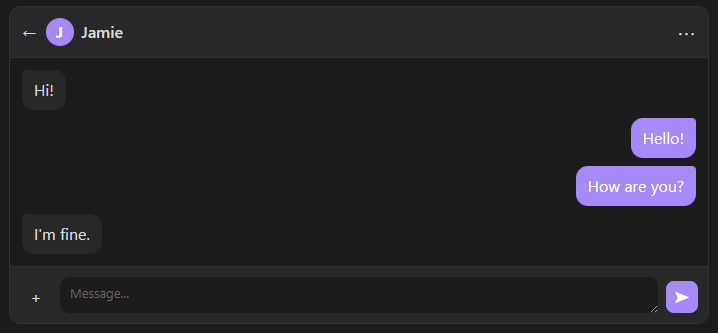

# Markdown Chat Blocks

Chat-style blocks for Obsidian. With this plugin, you can create simple chat-like blocks for any use case. It can be used to improve stories.

## Features

- Chat-style UI
- Custome chat title
- Dynamic profile picture
- Left / right bubbles
- An easy to use syntax
- Automatic alternating alignment

## Usage

> [!CAUTION]
> At the moment, the content of the chat bubbles are rendered as plain text.

The plugin has a very easy to learn syntax for the ideal user experience.
By default, the bubbles are automatically alternated between the two sides. However, you can override this, by adding `l: ` *(for left side)*, or `r: ` *(for right side)* in front of a line.

You can also set the title of the chat, by writing `title = "{}"` on the first line.

### Example

````
```chat
title = "Jamie"

l: Hi!
r: Hello!
r: How are you?
l: I'm fine.
```
````


### Installation

Install from Obsidian Community Plugins.

## Roadmap

- More customization options
- Markdown rendering for the message bubbles